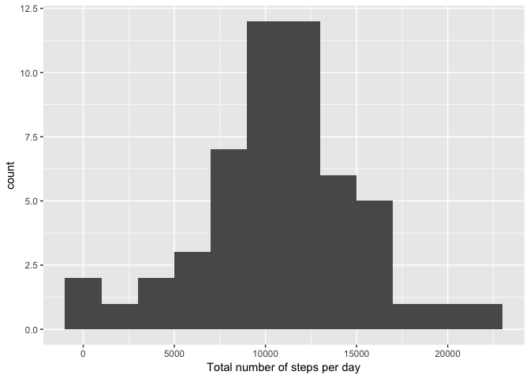
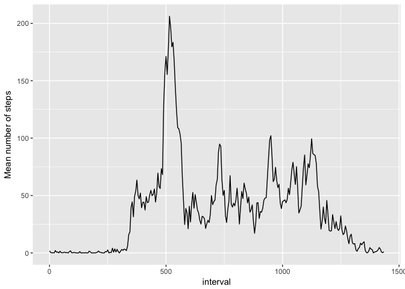
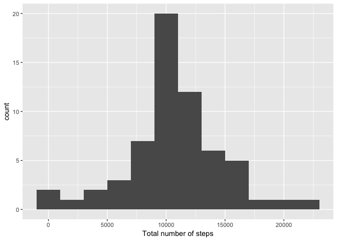
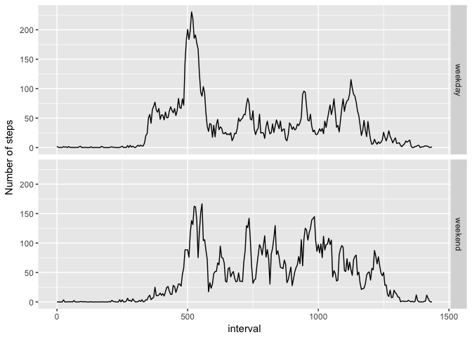

## Loading and preprocessing the data
Load the data file;
Group the data frame by date;
Calculate total number of steps for the groups


```r
library(ggplot2)
library(dplyr)
```

```
## 
## Attaching package: 'dplyr'
```

```
## The following objects are masked from 'package:stats':
## 
##     filter, lag
```

```
## The following objects are masked from 'package:base':
## 
##     intersect, setdiff, setequal, union
```

```r
setwd("/Users/alex/Documents/R/Reproducable_Research")
act <- read.csv("activity.csv")
tot_steps <- act %>% group_by(date) %>% summarize(sum(steps)) 
tot_steps <-  tot_steps %>% rename(sum_steps = `sum(steps)`)
```

## Plotting a total number of steps each day on a histogram
Plot a histogram;
Calculate and print the mean and the median of the total number of steps taken per day


```r
ggplot(tot_steps,aes(x = sum_steps))+
  geom_histogram(binwidth = 2000)+xlab("Total number of steps per day")
```

```
## Warning: Removed 8 rows containing non-finite values (stat_bin).
```

<!-- -->


```r
mean(tot_steps$sum_steps,na.rm = TRUE)
```

```
## [1] 10766.19
```

```r
median(tot_steps$sum_steps,na.rm = TRUE)
```

```
## [1] 10765
```

## What is the average daily activity pattern?
Group the data frame by intervals and calculate the mean number of steps for every interval averaged across all the days in the database;
Reformat interval column to have a have minutes continuously increasing (55,60,65,..)


```r
ave_steps <- act %>% group_by(interval) %>% summarize(mean_steps=mean(steps, na.rm = TRUE)) 
ave_steps <- ave_steps %>% mutate(interval = seq(0,1435,by = 5))
```
A time series plot of the 5-minute interval (x-axis) and the average number of steps taken, averaged across all days (y-axis)


```r
ggplot(ave_steps, aes(x = interval,y = mean_steps))+
  geom_line()+ylab("Mean number of steps")
```

<!-- -->

Which 5-minute interval, on average across all the days in the dataset, contains the maximum number of steps?


```r
ave_steps[which.max(ave_steps$mean_steps),]
```

```
## # A tibble: 1 x 2
##   interval mean_steps
##      <dbl>      <dbl>
## 1     515.       206.
```

## Imputing missing values

Calculate and print the total number of missing values in the dataset

```r
length(which(is.na(act$steps)))
```

```
## [1] 2304
```
A strategy for filling in all of the missing values in the dataset: NAs are reported for certain days, throughout the whole day (288 5-min intervals). 

```r
nan <- act %>% group_by(date) %>% summarize(NAN=length(which(is.na(steps))))
nan[nan$NAN > 0,]
```

```
## # A tibble: 8 x 2
##   date         NAN
##   <fct>      <int>
## 1 2012-10-01   288
## 2 2012-10-08   288
## 3 2012-11-01   288
## 4 2012-11-04   288
## 5 2012-11-09   288
## 6 2012-11-10   288
## 7 2012-11-14   288
## 8 2012-11-30   288
```
Thus, taking a mean/median of the steps for each interval averaged accross all days seems appropriate.
Create a new data frame by replacing NAs in the original dataset with the means of the steps for each interval:

```r
act_narm <- act
act_narm[act_narm$date == "2012-10-01" |
           act_narm$date == "2012-10-08" |
           act_narm$date == "2012-11-01" |
           act_narm$date == "2012-11-04" |
           act_narm$date == "2012-11-09" |
           act_narm$date == "2012-11-10" |
           act_narm$date == "2012-11-14" |
           act_narm$date == "2012-11-30","steps"] <- ave_steps$mean_steps
```

Calculate the total number of steps taken each day and make a histogram:

```r
tot_steps_nafill <- act_narm %>% group_by(date) %>% summarize(sum(steps)) 
tot_steps_nafill <-  tot_steps_nafill %>% rename(sum_steps = `sum(steps)`)
ggplot(tot_steps_nafill, aes(x=sum_steps)) +
  geom_histogram(binwidth = 2000) +xlab("Total number of steps")
```

<!-- -->
Calculate and print the mean and median total number of steps taken per day: 

```r
mean(tot_steps_nafill$sum_steps)
```

```
## [1] 10766.19
```

```r
median(tot_steps_nafill$sum_steps)
```

```
## [1] 10766.19
```

The values are very similar between before and after imputing!
The impact of imputing missing data on the estimates of the total daily number of steps is insignificant.

## Are there differences in activity patterns between weekdays and weekends?

Create a new factor variable "WdayWend" in the dataset with two levels – “weekday” and “weekend” indicating whether a given date is a weekday or weekend day.

```r
w_day <- weekdays(as.Date(act_narm$date))
w_day <- w_day == "Saturday" | w_day == "Sunday"
weekday_weekend <- factor(w_day,labels = c("weekday","weekend"))
act_narm <- act_narm %>% mutate(WdayWend = weekday_weekend)
```
Group the data by group and interval and calculate the mean of number of steps for each interval averaged
across weekdays and weekends separately


```r
ave_wdwe <- act_narm %>% group_by(WdayWend,interval) %>% summarize(mean_steps=mean(steps))
```
Reformat the interval column:

```r
ave_wdwe <- ave_wdwe %>% mutate(interval = seq(0,1435,by= 5))
```
Make a panel plot containing a time series plot of the 5-minute interval (x-axis) and the average number of steps taken, averaged across all weekday days or weekend days (y-axis):

```r
ggplot(ave_wdwe,aes(x=interval,y=mean_steps))+geom_line()+facet_grid(WdayWend~.)+ylab("Number of steps")
```

<!-- -->

